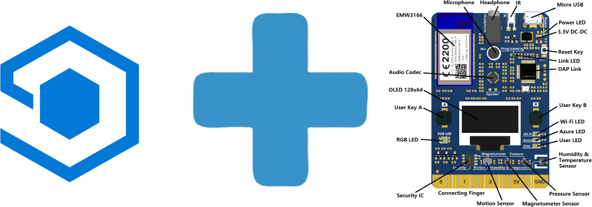
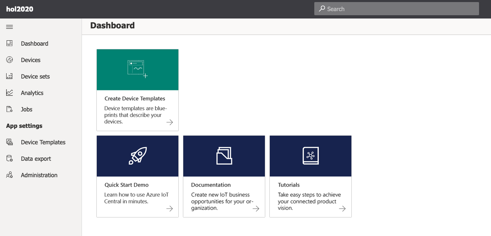
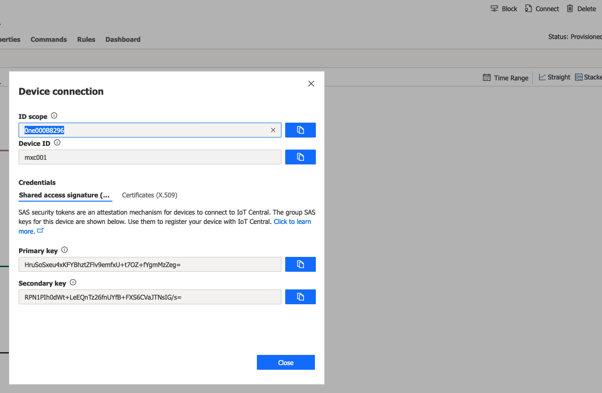

  

This hands-on lab is repurposed content from the [official documentation](https://docs.microsoft.com/en-us/azure/iot-central/core/howto-connect-devkit).

# Create an IoT Central Application  
Navigate to the Azure IoT Central [Application Manager](https://aka.ms/iotcentral). Scroll down the page and press the button labelled _Create a custom app_.  
Choose an appropriate name for the APP, select _Legacy Application_ as template and the subscription You will use. You can select the option for a free trial if You don't intend to revisit this lab in the future.  
Press _Create_

IoT Central works with the plug and play (PnP) concept, where device vendors create device templates that can be used to quickly provision devices to the application. The MXCHIP is a PnP device. On the landing page of your newly created app, navigate further by pressing _Create Device Templates_:  

  

The next screen shows a few PnP devices. Choose the ready made template for the MXCHIP. You can add your MXChip to your application by selecting _Devices_ on the left side menu.  

Notice that the **MXChip (1.0.0)** device template is the one selected in the Device Explorer. To start connecting a real air conditioner device that uses this template, select +, then _Real_. Choose a suitable name and press _Create_.  

The device is now ready to be provisioned via DPS, and for that we need a couple of parameters. Select _Connect_ at the top right corner of your APP display and make a note of the ID scope, Device Id and the Primary Key:

  


# Provision the DevKit device

1. We need to have the proper FW on the device. Depending on the HW version, you might already have the correct FW. If the device screen shows as below, You already have the correct FW, skip to point 5: 

```
    Connect HotSpot:
    AZ3166_??????  
    go-> 192.168.0.1  
    PIN CODE xxxxx  
```
2. If your screen is different, download the v2.1.0 release of the pre-built Azure IoT Central firmware for the MXChip from the [releases](https://github.com/Azure/iot-central-firmware/releases/tag/mxchip-v2.1.0) page on GitHub. 
3. Connect the DevKit device to your development machine using a USB cable. In Windows, a file explorer window opens on a drive mapped to the storage on the DevKit device. For example, the drive might be called AZ3166 (D:).
4. Drag the iotCentral.bin file onto the drive window. When the copying is complete, the device reboots with the new firmware.
5. The device is now in access point (AP) mode. You can connect to this WiFi access point from your computer or mobile device.
6. On your computer, phone, or tablet connect to the WiFi network name shown on the screen of the device. When you connect to this network, you don’t have internet access. This state is expected, and you’re only connected to this network for a short time while you configure the device.
7. Open your web browser and navigate to http://192.168.0.1. The following web page displays:
  
8. Enter the data for the **wifi** we will be using in the lab.
9. The **PIN code** is displayed on the device screen.
10. The connection details **Scope ID**, **Device ID**, and **Primary key** of your device.
11. Press _Configure device_, which will transfer the configurations to the device. This action will also trigger the provisioning sequence, and after a minute or two your device should be sending telemetry to the APP.

# Explore the template  

When the DevKit device restarts, the screen on the device shows:

    The number of telemetry messages sent.
    The number of failures.
    The number of desired properties received and the number of reported properties sent.

1. Verify the telemetry displayed on the Measurements  tab. Move it a bit and see the accelerometer graph change.  

2. Shake the device to send a reported property. The device sends a random number as the Die number device property. Verify that on the Properties tab

3. Select the Commands tab and send a message to the device using the _Echo_ command. 

## Bonus task

Enter the Rules tab and press Learn more to create a rule.


