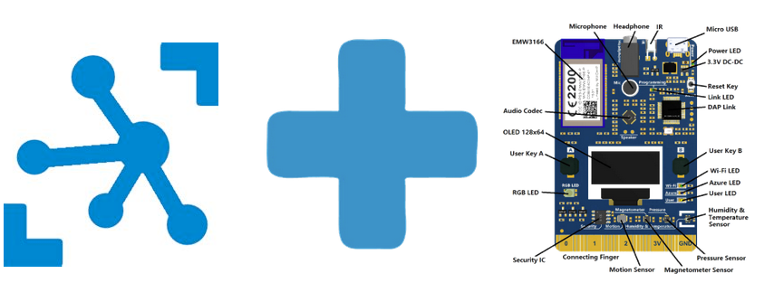

# IOT HUB  

  
  

For this lab we will monitor measurements coming from the MXChip to an IoT Hub, save the messages to blob storage and report back to the device via an Azure Function if the device measurement falls beyond a threshold.  


## Create Resource group

Sign in to <http://portal.azure.com>

On the left pane choose Resource Groups
Click the "+ Add" button to create a new Resource group
Give the Resource group a name and choose North Europe as region

## Create IoT Hub
You might need to the refresh icon in Azure to see your new Resource group
Select your new Resource group and then click the "+ Add" button to add an IoT hub
Search for IoT Hub and then click “Create”

IoT Hub setting:   
- Give the IoT Hub a name   
- Select the S1 pricing tier  
- Use the Resource group you just created  
- Location North Europe

Go back to your Resource group and verify that the IoT Hub there

## Create Blob storage
Add a Storage account to your Resource group
 
Storage account settings:   
* Give the Storage account a name  
* Select your Resource group  
* Location North Europe  
* Leave everything else with default settings  

## Provision the DevKit device

1. We need to have the proper FW on the device. In the previous lab we were using the IoT Central specific FW, we need now to change this into the generic bootloader, chich can be found [here](https://1drv.ms/u/s!AiMLTNM1CDMguJdh0Lk2Os3CArbMYQ?e=yWVnW6) 

```
    Connect HotSpot:
    AZ3166_??????  
    go-> 192.168.0.1  
    PIN CODE xxxxx  
```
2. If your screen is different, download the v2.1.0 release of the pre-built Azure IoT Central firmware for the MXChip from the [releases](https://github.com/Azure/iot-central-firmware/releases/tag/mxchip-v2.1.0) page on GitHub. 
3. Connect the DevKit device to your development machine using a USB cable. In Windows, a file explorer window opens on a drive mapped to the storage on the DevKit device. For example, the drive might be called AZ3166 (D:).
4. Drag the IoT Central .bin file onto the drive window. When the copying is complete, the device reboots with the new firmware.
5. The device is now in access point (AP) mode. You can connect to this WiFi access point from your computer or mobile device.
