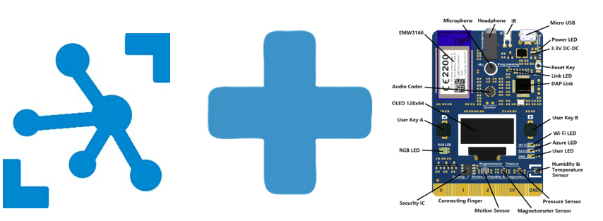

# IOT HUB  

  
  

For this lab we will monitor measurements coming from the MXChip to an IoT Hub, save the messages to blob storage and report back to the device via an Azure Function if the device measurement falls beyond a threshold.  


## Create Resource group

Sign in to <http://portal.azure.com>

On the left pane choose Resource Groups
Click the "+ Add" button to create a new Resource group
Give the Resource group a name and choose North Europe as region

## Create IoT Hub
You might need to the refresh icon in Azure to see your new Resource group
Select your new Resource group and then click the "+ Add" button to add an IoT hub
Search for IoT Hub and then click “Create”

IoT Hub setting:   
- Give the IoT Hub a name   
- Select the S1 pricing tier  
- Use the Resource group you just created  
- Location North Europe

Go back to your Resource group and verify that the IoT Hub there

Now we will add a few consumer groups, which we will need later. On the IoT Hub blade, select Built-in endpoints and create two consumer groups, call one asa and another timeseries.  


## Manually Provision a device

1. In the portal, go to the IOT Hub page, and select Iot Devices on the left panel.
2. Press '+'
3. Give the device a name, keep the other values as defaults. Press _Save_
4. IoT Hub will create a symmetrical key. Once the device is created, copy the connection string, you will need it later.

## Provision the DevKit device

1. We need to have the proper FW on the device. In the previous lab we were using the IoT Central specific FW, we need now to change this into the generic bootloader, chich can be found [here](https://github.com/microsoft/devkit-sdk/releases/download/1.6.5-release/devkit-getstarted-1.6.5.bin) 

```
    Connect HotSpot:
    AZ3166_??????  
    go-> 192.168.0.1  
    PIN CODE xxxxx  
```
2. Connect the DevKit device to your development machine using a USB cable. In Windows, a file explorer window opens on a drive mapped to the storage on the DevKit device. For example, the drive might be called AZ3166 (D:).
4. Drag the FW .bin file onto the drive window. When the copying is complete, the device reboots with the new firmware.  
Press the B button. Press and release the reset button. See that the screen displays: 

```
    IoT DevKit - AP
    Az-cxxxx...  
    Configuration
    192.168.0.1  
```
5. The device is now in access point (AP) mode. You can connect to this WiFi access point (AZ-cxxxx...) from your computer or mobile device. 
6. On your computer, phone, or tablet connect to the WiFi network name shown on the screen of the device. When you connect to this network, you don’t have internet access. This state is expected, and you’re only connected to this network for a short time while you configure the device.
7. Open your web browser and navigate to http://192.168.0.1. The following web page displays: 


   

8. Enter the data for the **wifi** we will be using in the lab.
9. The **Azure IoT Settings** will be the connection string of the device we created earlier in this lab. Paste that into the window and press _Configure Device_  
    NOTE: You need to do this using the Edge browser. The katest versions of the FW are somewaht buggy and will not work with Chrome Firefox or Safari.
9. A successfull configuration should get the device to reboot and start to send telemetry to IoT Hub.

## Verify the telemetry

If you have not yet done so, now is a good opportunity to install Visual Code on your laptop. If you already have, make sure to download the IoT Tools Extension. Get it from [here](https://marketplace.visualstudio.com/items?itemName=vsciot-vscode.azure-iot-tools).

ONce you have downloaded and configured it (as per the URL above), you can monitor the telemetry by selecting your device and monitoring the Built in Endpoint  

   

If everything worked fine, you should be able to see the telemetry in the otuput window as below:  

   

Note that while the device has many sensors, the current sample only sends temperature and humidity to the cloud. You can quickly chage these vaues by blowing hot air with your mouth on the bottom right corner of the device, where the sensor is ;)

## Send a C2D message to the device

Go into the portal and select your device, then choose the interface for sending messages to the device. Enter a message, send it and verify that it is displayed on the MXChip.

   

## Inspect the twin document

Using the portal interface, look at the device twin document. Note that the current sample in the firmware does not make use of this powerful interface. There are many tutorials available online that can show you how to create your own FW. Time allowing, let's try [this](https://docs.microsoft.com/en-us/samples/azure-samples/mxchip-iot-devkit-state/sample/).
In the meantime, we may hav enoticed that in the telmetry we are receiving, there is a field for device location, which is currently not set, and therefore we see:
```
    "DeviceLocation": "$twin.tags.location"
```
Let's edit the twin document in the portal by adding a tag as:
```
  "tags": {
      "location": "orebro"
      },
```
Add this right before the "properties" key. Save the document.  
Verify that now the telemetry shows the device location tag !

[GO TO LAB 2.1](../lab21)

