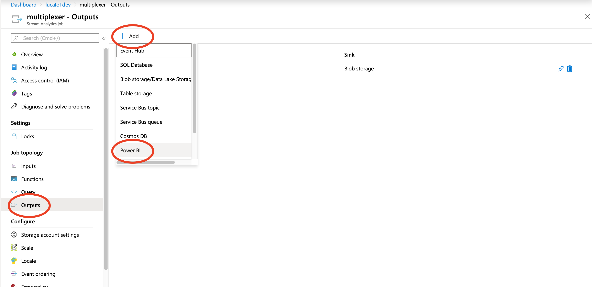
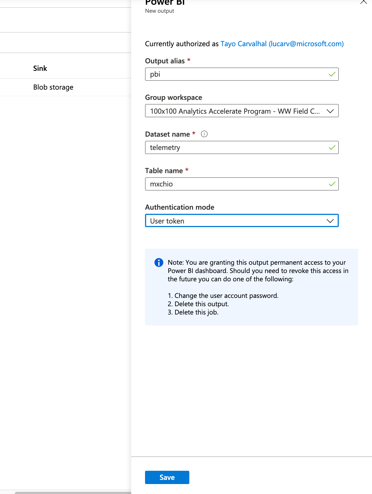
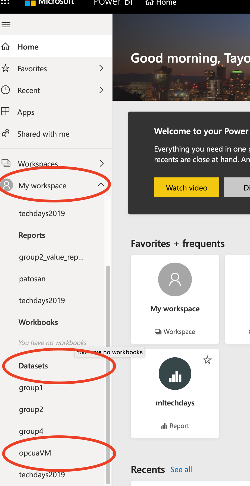
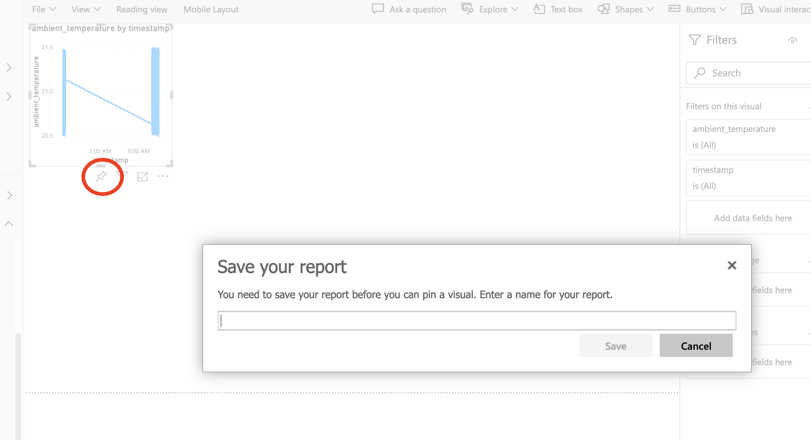

# LAB 2 Part 3: Visualizing  

For this lab we will attach create stream datasets as a sink from the stream analytics.  
This streaming dataset will be used to create dashboards.

## Create new sink on Stream Analytics

1. Open the Stream analytics job we crerated in the previous lab
2. Click Output to create a new input for the Stream Analytics job
3. Choose Power Bi  

  

4. You will need to authorize power BI separately. Login to your Power BI account using your account.
5. Provision your dataset. Choose uder token as authentication mode  



6. Choose "Edit query", and change the input to the alias name you created for the IoT Hub. Add the following query: 

```sql
SELECT 
    [<Make sure temperature, timestamp are selected>]
INTO
    [<YOUR POWER BI SINK ALIAS>]
FROM 
    [<YOUR IOTHUB ALIAS>]
```    

7. Save the work and start the job from the overview pane on the Stream Analytics Job page. 

## Create the dashboard

1. On a web browser, go to powerbi.com.
2. Sign in.
3. Verify that the streaming dataset was created.  



4. Create a dashboard that displays the temperature time series. Chhose the time series widget as below. Drag and drop **Temperature** into Values and **your timestamp** into Axis.
5. Pin the visual into a report and further into a dashboard  



[NEXT LAB](../lab24)

