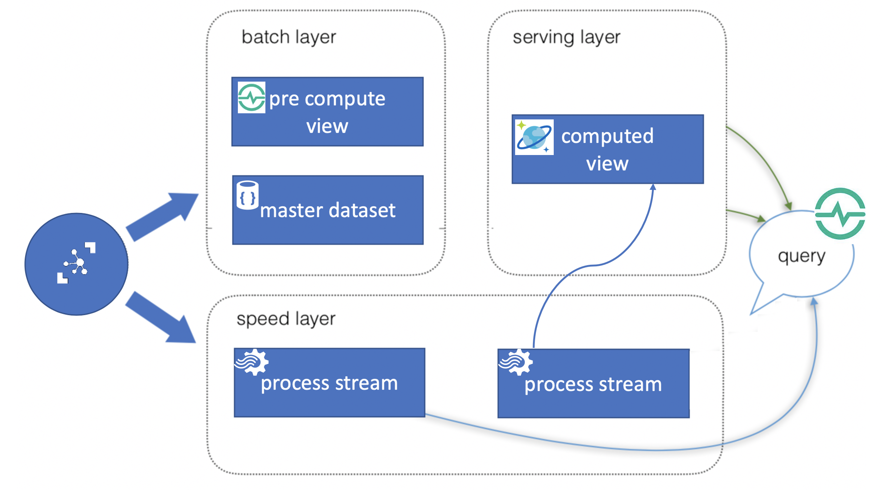
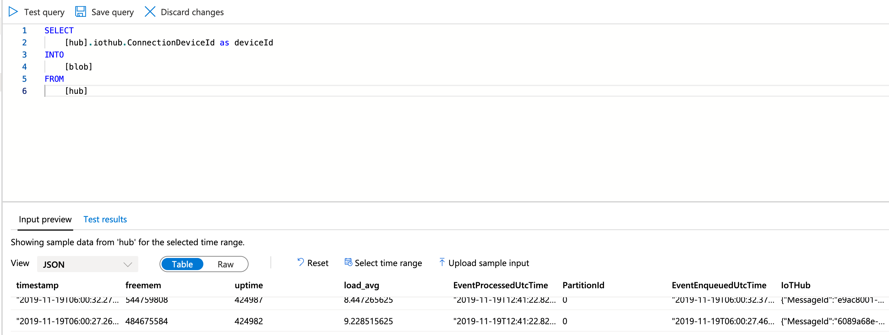

# LAB 2: Lambda Architecture Speed and Serving Layer  

For this lab we will attach a stream processor that will subscribe to the telemetry from IoT Hub. It will observe the event flow, we will then push the data into a serving layer



## Create Cosmos DB

1. Select your Resource group and then click the "+ Add" button to add to the serving layer
2. Search for Cosmos DB and then click “Create”
4. Select the Subscription, Resource Group and Region
5. Give an account name
6. Leave everything else with default settings
7. Press “Create“

## Create Stream Analytics Job

1. Select your Resource group and then click the "+ Add" button to add a Stream Analytics Job
2. Search for Stream Analytics Job and then click “Create”
3. Enter a job name (unique within the resource group)
4. Select the Subscription, Resource Group and Region
5. Choose Cloud as Hosting environment
6. Leave everything else with default settings
7. Press “Create“
8. Go back to your Resource group and select the Stream Analytics job
9. Click Input to create a new input for the Stream Analytics job
10. Click the “Add Stream Input” button, select IoT Hub and setup it up to receive messages from your IoT Hub. Give it a name. select the **asa** consumer group and leave the other default values.
11. Choose "Edit query", and change the input to the alias name you created for the IoT Hub. Enter the following query:
```sql
SELECT 
    *
FROM 
    [<YOUR IOTHUB ALIAS>]
```    
12. Let's observe the stream before we create a query. 



13. Note that Stream Analytics is automatic sampling data from Iot Hub.

### Send Data to Cosmos DB

1. Add an output to your job. Choose to output to a database in your newly created Cosmos Account. 
2. Create a  Query as to select telemetry INTO the DB
```sql
SELECT *
INTO
    [<YOUR COSMOSDB ALIAS>]
FROM 
    [<YOUR IOTHUB ALIAS>]
```  

### Send Data to Blob

In the previous lab, we had a route from IoT Hub to Blob that we disabled. If you would go back to the Portal and re-enable it, You would notice that no messages reach Stream Analytics (that is why we will NOT do it now). One way of still keeping the pattern is to have Stream Analytics do the routing instead. So let's do that.
1. Click the “Add Stream Output" button, select Blob Storage and setup it so telemetry is stored in the container we created in Lab 1. Choose to store the data in parquet format.  
2. Create another Query as to select telemetry INTO the container
```sql
SELECT *
INTO
    [<YOUR BLOB ALIAS>]
FROM 
    [<YOUR IOTHUB ALIAS>]
```  

### Start the job

1. Save the work and start the job from the overview pane on the Stream Analytics Job page. 
2. Verify that telemetry is again stored in the container. 
3. Verify the telemetry is stored in Cosmos DB  

[NEXT LAB](../lab24)  
